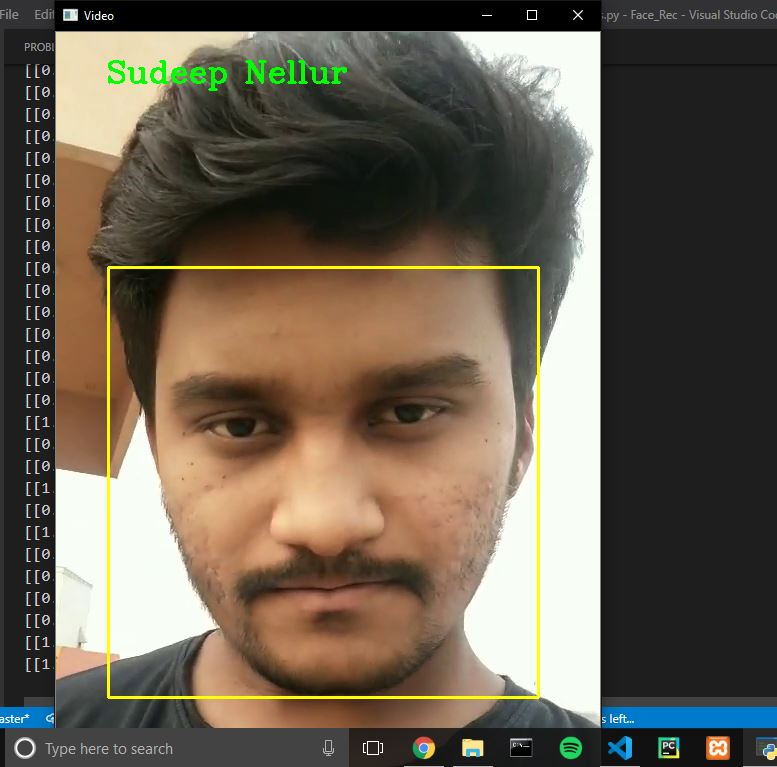
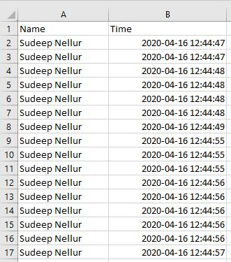

# FaceRec with TimeStamps
A Deep Learning Project for Face Recognition with Timestamps

Here I have used CNN model with VGG16 architecture for training the model. Used HaarCascade for extracting faces from video.

Here's the sample snapshot of prediction:

After recognition of particular faces a simple timestamps are collected from system's time and later saved it .csv file format where the identity of the person and time is saved.

Here's the sample snapshot of timestamp file:

